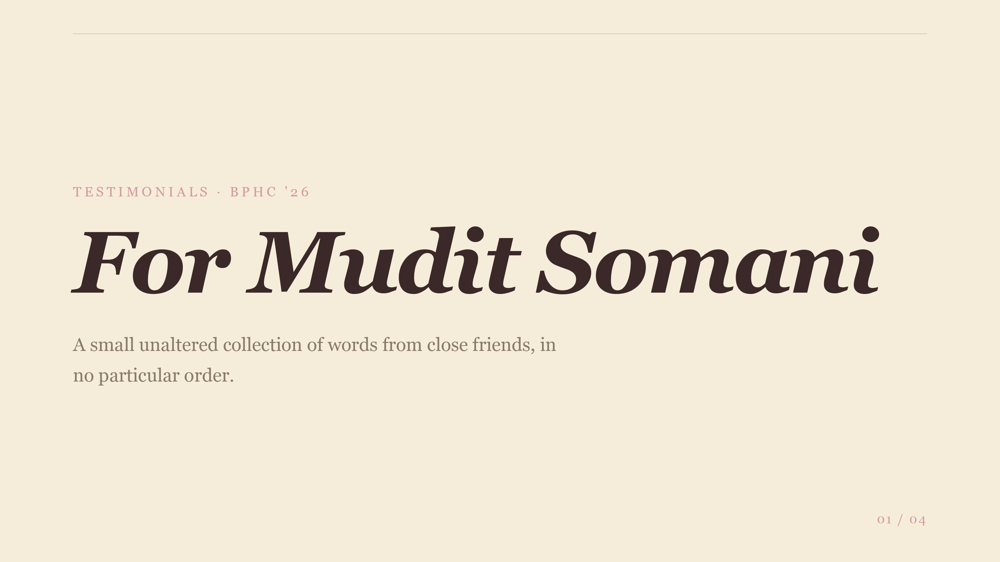
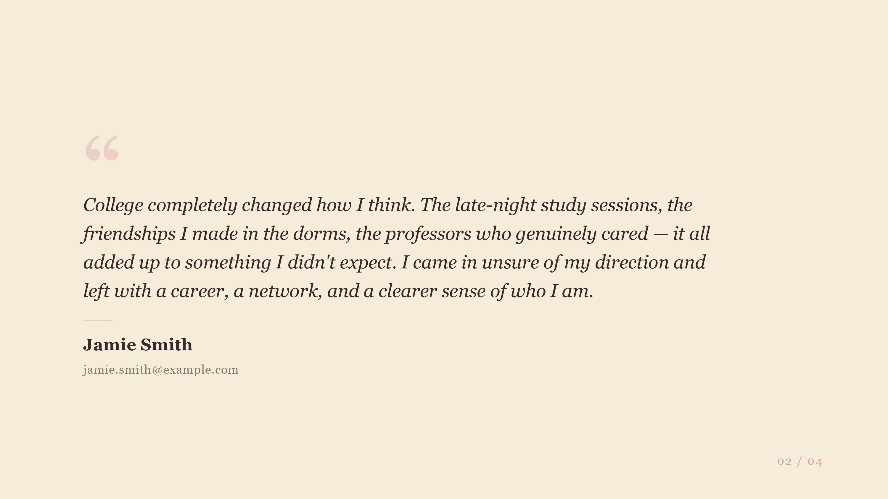
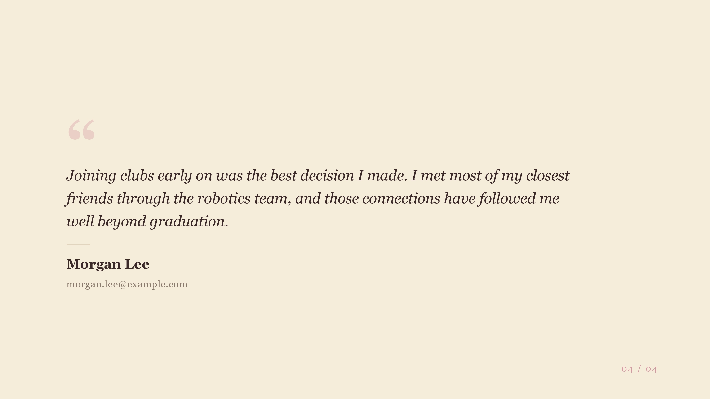

# BPHC Testimonials

I don't trust the yearbook nostalgia people to display, save, truncate or just print our testimonials properly, so here is a tool to scrape and convert your testimonials into a beautiful looking PDF / Website / Slide Show.

[→ View Demo PDF](./demo/Demo.pdf)

| | |
|:---:|:---:|
|  |  |
|  |  |

---

## Getting Started

### 1. Install

Make sure you have [Bun](https://bun.sh) installed, then clone this repo and install dependencies:

```sh
bun i
```

> This project uses [open-slide](https://open-slide.dev/) to power the slide show.

---

### 2. Scrape Testimonials

1. Go to [yearbooknostalgia.com/portal/user-testimonial](https://yearbooknostalgia.com/portal/user-testimonial) and open the **Sequence** tab.
2. Paste the following snippet into the browser console:

```js
[...document.querySelectorAll('.test-sec')].map(el => ({
  name:    el.querySelector('.postname')?.textContent.trim() ?? '',
  email:   el.querySelector('.col-lg-6 p')?.textContent.trim() ?? '',
  comment: el.title ?? '',
}))
```

3. Right-click the output and select **Copy Object**.
4. Paste it into `slides/testimonials/assets/data.json`, keeping the same shape.

---

### 3. Preview & Modify

Start the live preview:

```sh
bun dev
```

You can ask your AI agent to modify the slide show, and changes will be reflected in real time.

---

### 4. Export

Use the **Export** option in the preview UI to convert the slide show into a PDF or static website.

---

*Made by [TheComputerM](https://github.com/thecomputerm) (Mudit Somani)*
